# MicroPython ESP8266

This project contains few separated smaller projects running on esp8266 under micropython control. Projects are usefull to control WS2812B leds, relays, sonoff module etc. The project is still developing.

## Projects

All projects listed in [sources/projects](sources/projects) are separated. Everyone has a different goal. Quick summary of each one is listed below.

### Pin Scheduler

It auto controls pins (set high or low state) by set schedule time. I used this to automatically water the flowers during the holidays.

### Animator

It controls WS2812B leds (and similiar). It offers few animations, solid color, changing leds count, animation speed. Everything can be changed Android app.

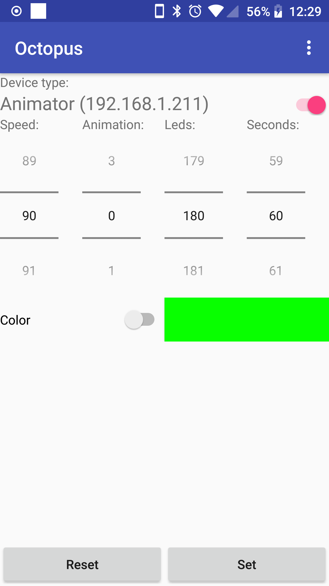 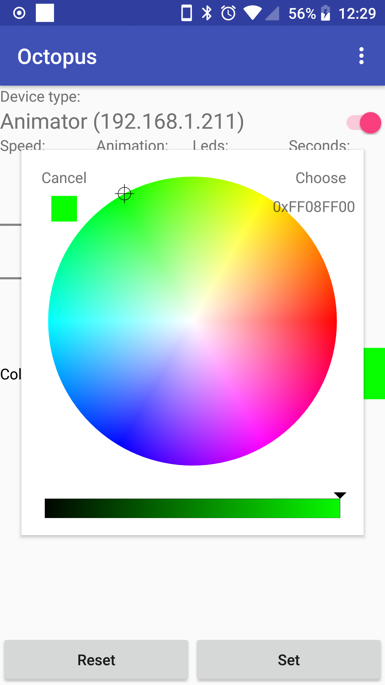 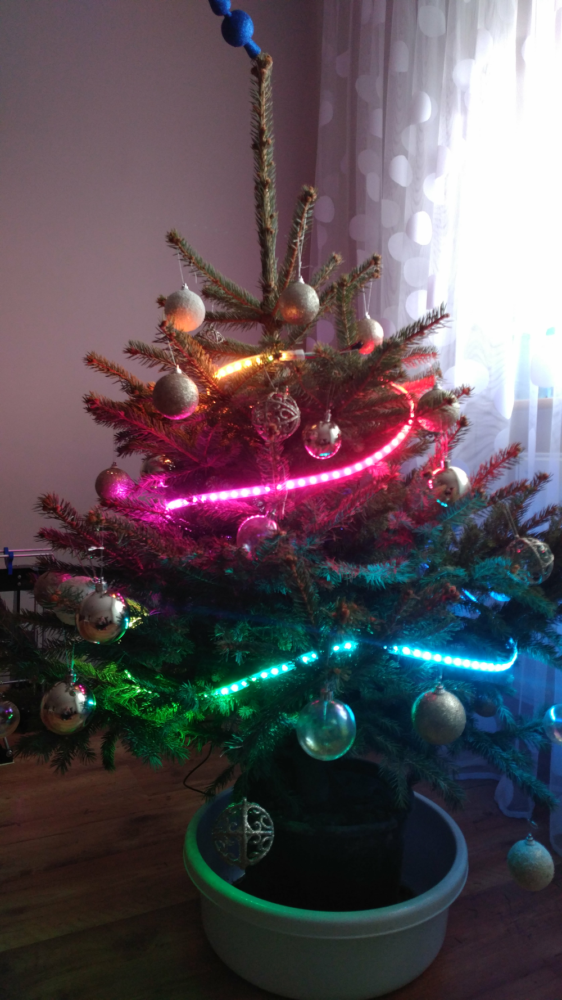 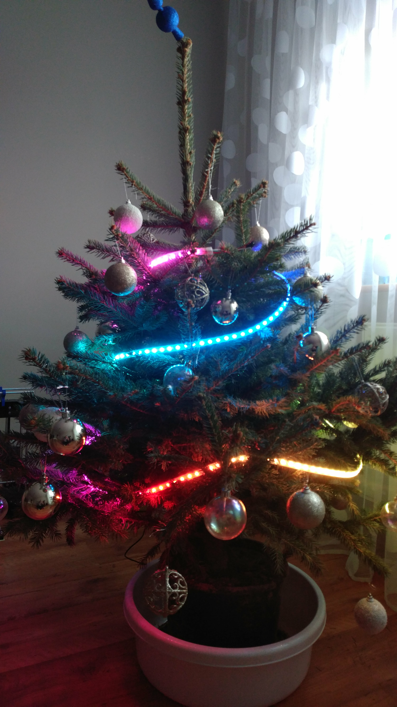

### Remote Socket

It controls pins (you can set high or low state).

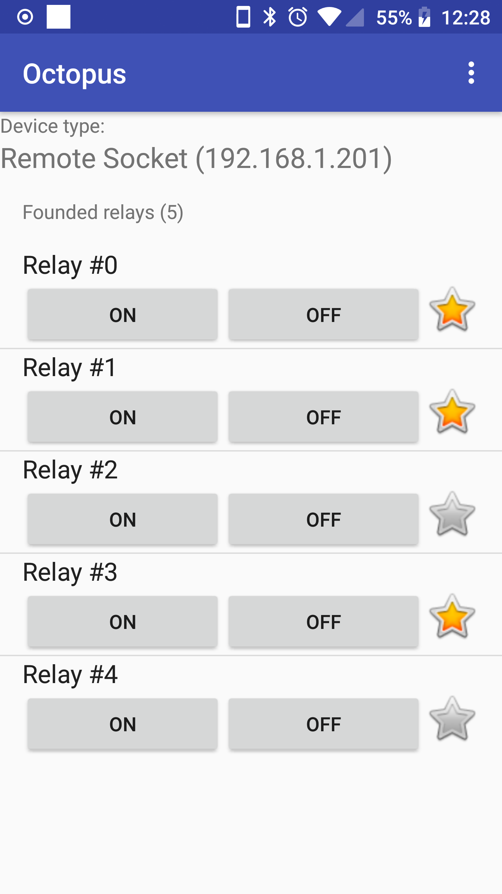

### Sonoff

It controls sonoff device (for now support S20, S26, switch, touch).

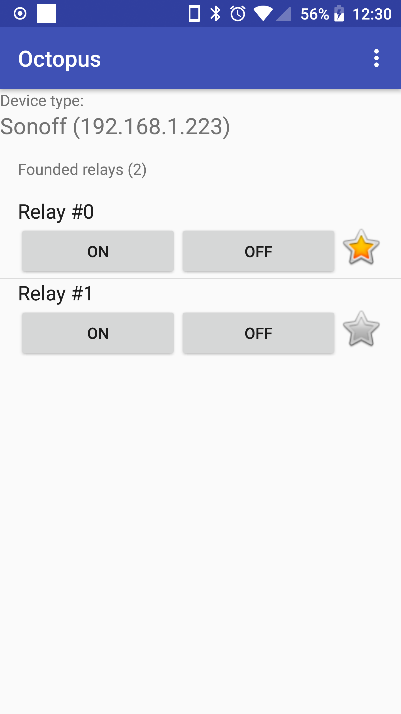 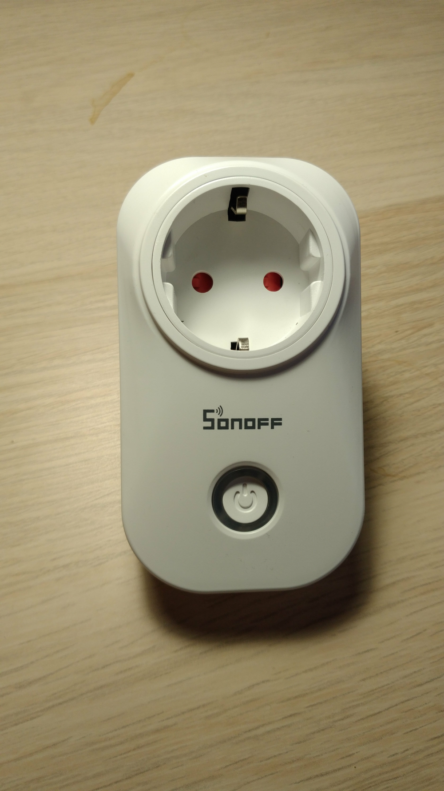 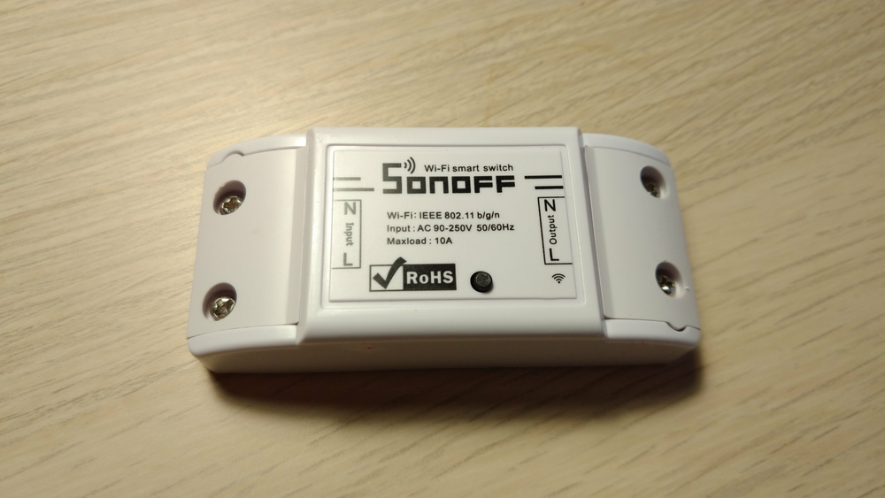 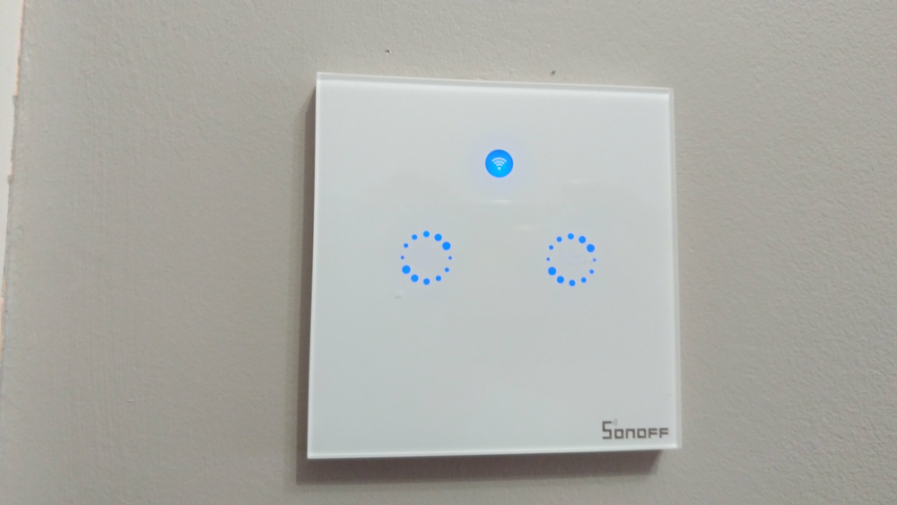

### Thermometer
It uploads temperature every one minute (read by Dallas DS18B20 sensor) to the server. You can adapt it to use any server (for example: [thingspeak](https://thingspeak.com/), [thingsboard](https://thingsboard.io/), [domoticz](https://github.com/domoticz/domoticz) in few minutes. I used my own website (which I can share someday).

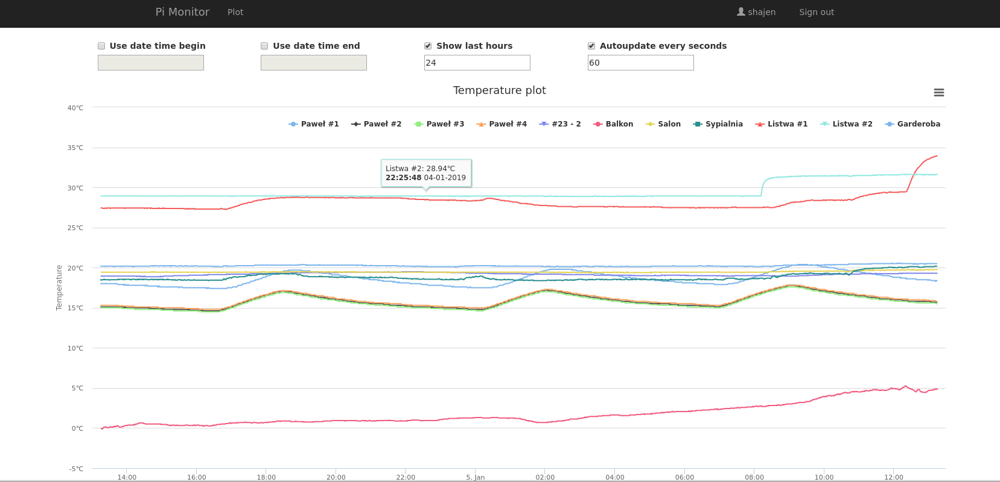

It also supports segment LCD 16x2, on which shows current temperature.

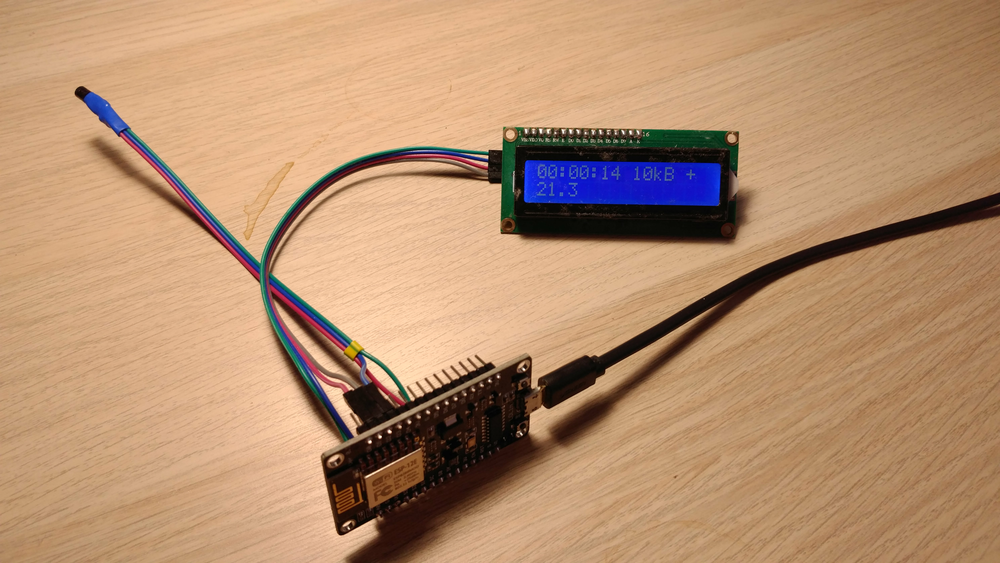

### Thermometer Low Power

This is low power version of Thermometer. Project uploads temperature and goes deep sleep. Wakes up only to upload data. LCD is not supported.

## Android remote control app

I shared Android app named [Octopus](https://github.com/shajen/octopus) to control esp via Wifi. The application is available in [Google Play](https://play.google.com/store/apps/details?id=pl.shajen.octopus).

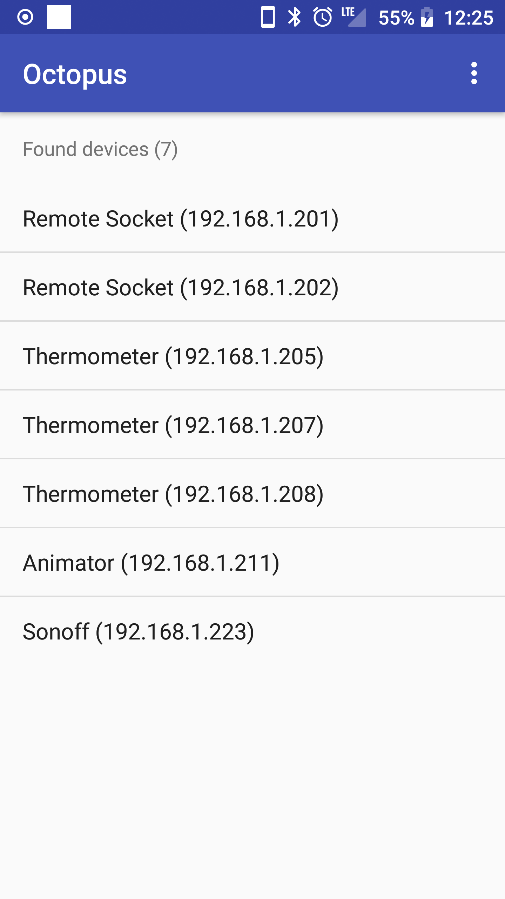 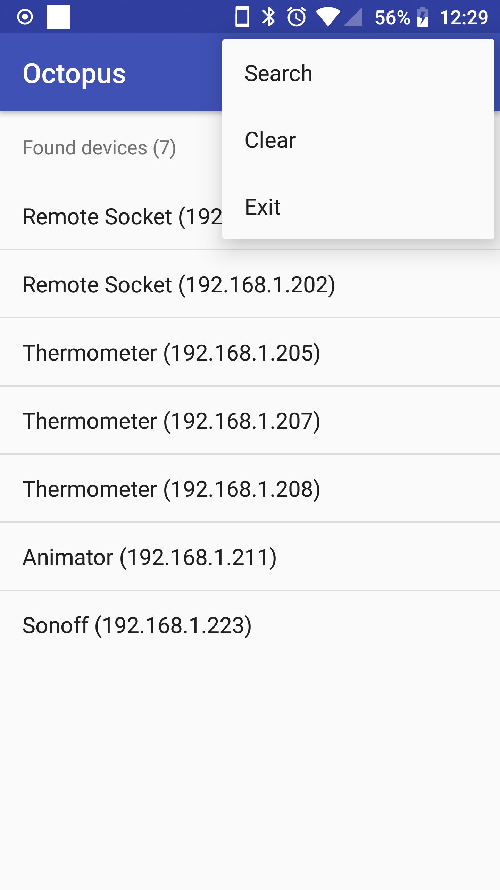 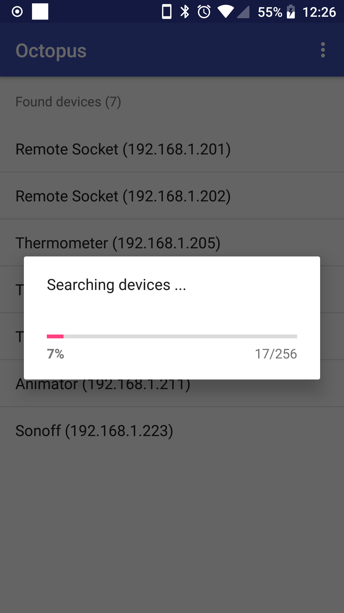 

## Getting Started

These instructions will get you a copy of the project up and running on your local machine for development and testing purposes.

### Prerequisites

You need some tools to start the work.

```
esptool.py
```
```
ampy
```

Install it before continue. For example on Debian based distribution run follow commands:
```
sudo apt-get install esptool
sudo pip install adafruit-ampy
```

### Repository

Clone the repository into your local machine. After that, update submodules.
```
git submodule update --init
```

### Configuration

All settings are stored in [config](config) file. Settings that you need to change:

Set correct IP. Changed:
```
IP='192.168.1.100'
```
to your IP.

Set correct uart port. Replace:
```
DEVICE='/dev/ttyUSB0'
```
to your uart port.

Set webrepl secure password (if you don't want to use default). Change:
```
PASS='YOUR_PASSWORD'
```
to your password.

Set correct ssid and password. Change:
```
NETWORKS={"SSID_1":"PASSWORD_1","SSID_2":"PASSWORD_2"}
```
to your WiFi settings.

### Flashing firmware

To flash your board with latest micropython firmware run follow command:
```
scripts/firmwares/micro_firmware_esp8266.sh
```

### Deploying project

All projects listed in [sources/projects](sources/projects) has matching script in [scripts/projects](scripts/projects) to deploy it to board.

Choose any project and run scripts to deploy into the board. For example to run WS2812B leds project run command:
```
scripts/projects/micro_ws2812.sh
```

## Contributing

In general don't be afraid to send pull request. Use the "fork-and-pull" Git workflow.

1. **Fork** the repo
2. **Clone** the project to your own machine
3. **Commit** changes to your own branch
4. **Push** your work back up to your fork
5. Submit a **Pull request** so that we can review your changes

NOTE: Be sure to merge the **latest** from **upstream** before making a pull request!

## Donations

If you enjoy this project and want to thanks, please use follow link:

[](https://www.paypal.com/cgi-bin/webscr?cmd=_donations&business=shajen@shajen.pl&lc=US&item_name=Donate+Micropython+esp8266&no_note=0&cn=&curency_code=USD)

## License

[](https://www.gnu.org/licenses/gpl.html)

- *[GPLv3 license](https://www.gnu.org/licenses/gpl.html)*

## Acknowledgments

- *[MicroPython](https://micropython.org/)*
